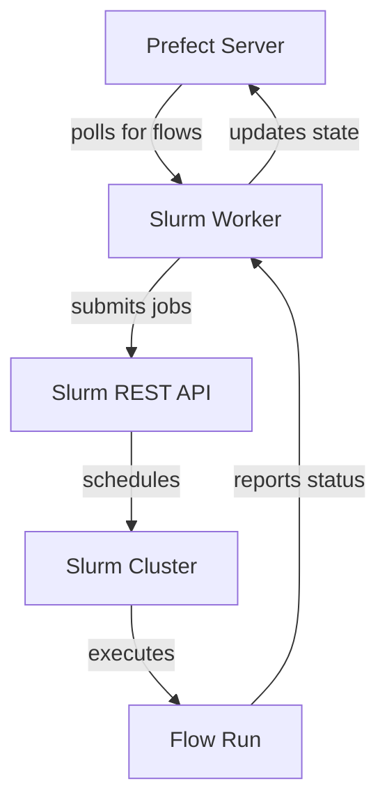

# Prefect-Slurm

**A Prefect worker for running flows on Slurm HPC clusters**

[](LICENSE)
[](https://python.org)
[](https://prefect.io)

Execute your Prefect flows on high-performance computing clusters using the Slurm workload manager. This worker seamlessly integrates with Slurm's REST API to submit, monitor, and manage flow runs as Slurm jobs.

## Features

✨ **Automatic API Version Detection** - Supports Slurm REST API versions 0.0.40-0.0.42 with automatic detection  
🔒 **Secure Token Management** - JWT-based authentication with file locking and proper permissions  
🔄 **Zombie Job Recovery** - Automatically detects and handles orphaned flow runs after worker restarts  
📊 **Resource Management** - Full Slurm job specification support for CPU, memory, and time limits  
🛠️ **CLI Tools** - Built-in utilities for token management and worker administration  
🧪 **Comprehensive Testing** - Both unit and integration tests

## Quick Start

### Installation

```bash
pip install prefect-slurm
```

### Basic Setup

1. **Create a work pool** using the Slurm worker type:
   ```bash
   prefect work-pool create my-slurm-pool --type slurm
   ```

2. **Configure authentication** - Set up your Slurm credentials:
   ```bash
   export PREFECT_SLURM_USER_NAME=your_username
   export PREFECT_SLURM_API_URL=http://your-slurm-server:6820
   ```

3. **Set up authentication token**:
   ```bash
   # Generate and store token using built-in CLI
   scontrol token username=$USER lifespan=3600 | prefect-slurm token
   
   # Or set token directly via environment variable
   export PREFECT_SLURM_USER_TOKEN=your_jwt_token
   ```

4. **Start the worker**:
   ```bash
   prefect worker start --pool my-slurm-pool --type slurm
   ```

### Example Flow

```python
import time
from prefect import flow, task

@task
def compute_task(n: int):
    """A simple compute task."""
    time.sleep(n)
    return n * 2

@flow
def my_hpc_flow(iterations: int = 10):
    """A flow that will run on your Slurm cluster."""
    results = []
    for i in range(iterations):
        result = compute_task(i)
        results.append(result)
    return results

if __name__ == "__main__":
    my_hpc_flow()
```

Deploy and run this flow, and it will execute as a Slurm job on your HPC cluster!

## Configuration

### Environment Variables

| Variable | Description | Default |
|----------|-------------|---------|
| `PREFECT_SLURM_USER_NAME` | Slurm username | **Required** |
| `PREFECT_SLURM_API_URL` | Slurm REST API URL | **Required** |
| `PREFECT_SLURM_USER_TOKEN` | JWT authentication token | Optional |
| `PREFECT_SLURM_TOKEN_FILE` | Path to token file | `~/.prefect_slurm.jwt` |
| `PREFECT_SLURM_LOCK_TIMEOUT` | File lock timeout (seconds) | `60` |

### Work Pool Configuration

Configure your Slurm work pool with job specifications:

```yaml
job_configuration:
  partition: "compute"
  cpu: 4
  memory: 8
  time_limit: 2
  working_dir: "/path/to/working/directory"
  source_files:  # Optional - omit for default Python environment
    - "~/.bashrc"
    - "~/envs/conda/bin/activate"
```

### Environment Setup

The worker supports two environment configuration modes:

**Custom Environment** (when `source_files` are specified):
```yaml
job_configuration:
  source_files:
    - "~/.bashrc"
    - "/opt/conda/bin/activate"
    - "/opt/modules/init.sh"
```
The worker will source these files before executing your flow. Use this for conda environments, module systems, or custom shell configurations.

**Default Python Environment** (when `source_files` is empty or omitted):
```yaml
job_configuration:
  partition: "compute"
  cpu: 4
  memory: 8
```
The worker automatically creates a temporary Python virtual environment with the matching Prefect version installed. The environment is created in `$TMPDIR/.venv_$SLURM_JOB_ID` and cleaned up after job completion.

## CLI Tools

The package includes a command-line utility for token management:

```bash
# Store token from scontrol output
scontrol token username=$USER lifespan=3600 | prefect-slurm token

# Store token to custom location
echo "jwt_token_here" | prefect-slurm token ~/my_token.jwt

# Get help
prefect-slurm token --help
```

## Architecture

The Slurm worker integrates with Prefect's execution model:

1. **Worker Polling** - Continuously polls Prefect API for scheduled flow runs
2. **Job Submission** - Converts flow runs to Slurm job specifications
3. **Execution** - Submits jobs via Slurm REST API with proper resource allocation
4. **Monitoring** - Tracks job status and reports back to Prefect
5. **Cleanup** - Handles zombie jobs and ensures proper flow run state management



## Requirements

- **Python**: 3.11+ (< 3.14)
- **Prefect**: 3.4.13+
- **Slurm**: Cluster with REST API enabled (versions 0.0.40-0.0.42 supported)
- **Network**: Access from worker node to both Prefect API and Slurm REST API

## Development

### Running Tests

```bash
# Unit tests only
pytest -m unit

# Integration tests (requires Docker)
pytest -m integration

# CLI tests
pytest -m cli

# All tests
pytest
```

### Test Environment

The project includes Docker-based Slurm cluster for integration testing:

```bash
cd slurm_environment/
docker-compose up -d
```

## Contributing

Contributions are welcome! This project is developed by the [EBI Metagenomics](https://www.ebi.ac.uk/metagenomics/) team.

### Development Workflow

1. Fork the repository
2. Create a feature branch
3. Make your changes with tests
4. Run the full test suite
5. Submit a pull request

## License

Licensed under the Apache License 2.0. See [LICENSE](LICENSE) for details.

## Support

- **Issues**: Report bugs and request features via [GitHub Issues](https://github.com/EBI-metagenomics/prefect-slurm/issues)
- **Documentation**: See [tests/README.md](tests/README.md) for detailed testing information